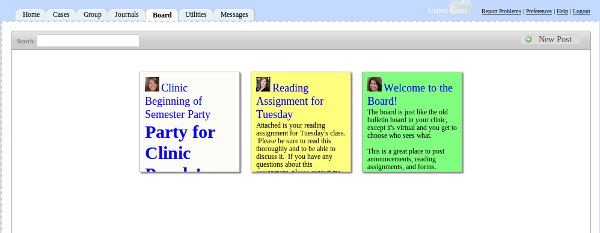
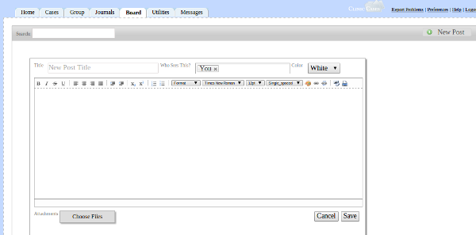

# Board Tab

The Board is a digital version of the bulletin board you probably have hanging in your conference room, the only difference being you can control who sees what.  This is a great place to post announcements, reading assignments, syllabi and similar material.

To post to the Board, click the "New Post" button in the upper right hand corner.  A dialog will appear which prompts you to put in the post information.

First, give your post a title.  Next, under "Who Sees This?", type the names of the users who are allowed to see this post.  Don't forget to include yourself!  You can include individual users, a supervisory group, or a user group (All Administrators, All Professors, etc.).  You can then choose a background color for your post.  Then type in the text of your post and click "Choose File" to add attachments, if any. (Note that multiple attachments can be uploaded at the same time -  in Chrome, Firefox, and Safari, but not Internet Explorer - by holding down the control key as you select files).  After you click "Save", each user you included in "Who Sees This?" will receive an email notification that you posted on their Board and will be able to read the whole post when they view their Board.

As a general rule, only the user who created the post is allowed to edit or delete it.  If you created the post, two links for "Edit" and "Delete" will appear under the post body. Administrators (anyone with the permission "can_configure" set to "1") can, however, edit or delete any post, regardless of who created it.

Over time, posts will be sorted by newest first, so that the newest posts on your Board appear at the top of the screen and the oldest at the bottom.  You can search for posts by typing search text in the Search box in the upper-left hand corner.  This search looks through post titles and bodies to find the relevant text.

