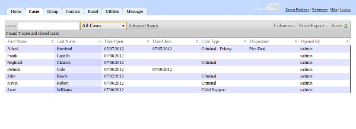
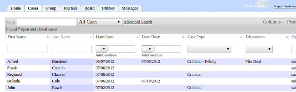
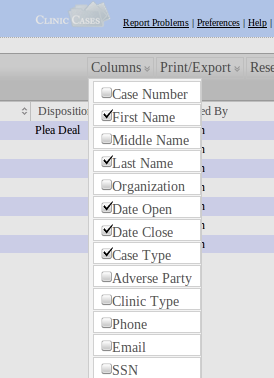
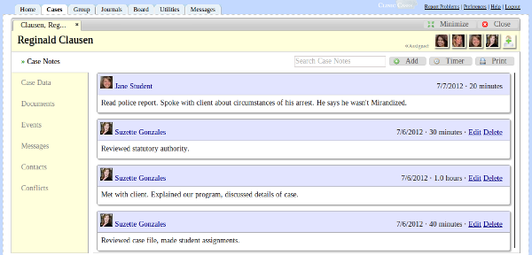
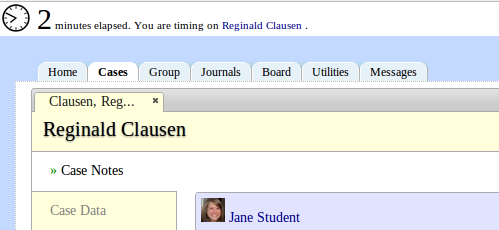
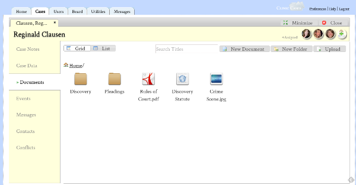
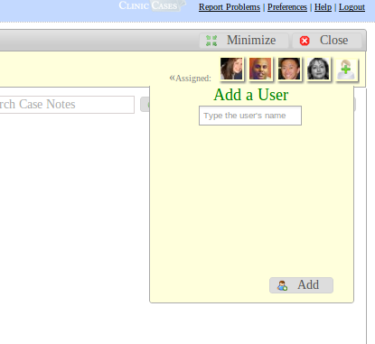

# Cases Tab

## Cases Table

The cases table shows you a list of all cases you are allowed to view.  If you have administrative privileges (i.e.,"view_all_cases" is set to "1" for your group in the cm_groups table - see [customizing groups](customization.md#Customize_Groups), you will see all cases on the system.  All other groups only see cases to which they have been assigned.

### Open/Close Filter
The default filter is set to display only cases that are open.  An open case is defined simply as any case which has no date closed.  You can switch the filter to show only closed cases or all cases.

* **Search:** The search box searches through all rows and columns (including those that are not displayed) for the search text you input.

* **Advanced Search:** Do fine-grained searches:

Clicking on advanced search will bring up a sub-header which allows you to search a specific column or combination of columns.  You can, for example, search for all cases opened between two dates, search for all cases with a specific disposition, etc.  When you are finished with your advanced search, click Reset and the table will be returned to its original state.

### Sort
You can sort each column row by clicking on table header for that row (e.g, "Last Name").  Clicking the header again will toggle between an ascending and descending sort.

### Columns
ClinicCases allows each user to determine which columns are displayed in his or her table.

Different users need different information from the cases table.  An administrator might be interested in who opened a case and the case number, but a professor might be more interested in who is assigned to the case and what court is in.  Because of this,  ClinicCases allows you to choose which columns are displayed in your table.  Just click on the Columns button and add a check by those columns which you wish to see.  ClinicCases will remember your chosen columns and display them every time you return to the Cases tab.  If you ever decide to go back to the default, just click "Restore Original" at the bottom of the columns list.

### Print/Export
There are a number of options for getting your data out of ClinicCases. When you click on the "Print/Export" button you will see choices to Copy to Clipboard, Export to CSV, Export to Excel, Export to PDF, or Print.  These actions will export the currently filtered data to the chosen format.  Print/Export is useful for generating reports and for exporting your data to a spreadsheet program for further analysis.

### Reset
Clicking the Reset button resets all filters on the table to the default (i.e, open cases).  Note that ClinicCases remembers the state of your filter.  So, if you were to search for all clients named "Smith" and then log off, when you return to the cases table later it will still display all clients named "Smith."  You must press reset to clear that filter.

### New Case
Administrative users (i.e, those with "add_cases" set to "1" for their group in the cm_groups table (see [customizing groups](customization.md#Customize_Groups)) will see a "New Case" button after the Reset button.  Clicking on this will open a new case and prompt you to input the intake information for the new case.  Once you have entered in the intake information, be sure to click "Submit".  The new case will now be opened.  You should next [assign users](cases-tab.md#Assign_Users_to_a_Case) to the case.

## Case Detail

When you click on a table row in the cases table, the case detail will be opened.

Think of this as opening the manila folder your physical files are kept in and seeing everything divided into neat tabbed sections.  There are seven sections for each ClinicCases file.

### Case Notes
Case Notes are the primary means of recording information about case activity.  They are the replacement for the "Timesheets" or "Memos to File" you may have in your paper files.  Each case note records the date on which the activity took place, the amount of time in took, and a description of the activity.  Note that in ClinicCases time is measured in 5 minute intervals by default.  You can change this to 6 minute intervals by editing the configuration file (see [configuration](customization.md#Customizing_Time_Units)).

There are three buttons above the case note list: 1) Add 2) Timer and 3) Print.  The first and third are self-explanatory.  The timer button will launch a timer that records your activity on the case.  This is useful for situations when you are working on a case in front of your computer (e.g, doing legal research).

Once you have clicked "Timer", it will continue to run until you turn it off.  This means that, even if you close your browser, when you return to ClinicCases, the timer will still be running. It is therefore important to remember to click "Stop" to turn it off.  When you do this, a dialog will ask you for a description of what you did.  Once you  provide that and click "Add", the case note will be filed away in the case with the correct time and information.

### Case Data
Case Data is where intake information about the client (Address, date of birth, SSN, case type, etc.) is kept.  Users who are authorized can click "Edit" and change the intake information.  Any user who is in a group with "edit_cases" set to "1" in the cm_groups table (see [configuration](customization.md#Customize_Groups) can do this.  By default, all users have this permission.

As of version 7.2.1, cases can be deleted. Users who have the "delete_cases" permission set to "1' in the cm_groups_table will find a delete button here, next to the edit button.  Cases are deleted in the following manner: if there is a case newer than the one you are trying to delete, then all data will be removed from this case, but the case itself will remain with the name "DELETED". This helps ensure that your case numbering is sequential and there are no missing cases.  If, however, there is not a newer case, the case will just be deleted and the case number can be re-used.  Note that when you delete a case, all associated data (case notes, documents, events, messages, and contacts) are removed.

### Documents
ClinicCases has a fully-featured file manager.

* **New Document** - Clicking this will open ClinicCases' rich-text editor and create a new ClinicCases document.  This is an alternative to creating a document on your desktop computer and is useful and time-saving for creating casual documents, such as digests of legal research, to-do lists, notes on interviews, etc.

* **New Folder** - Clicking on this button creates a new folder. You name the folder by clicking under the folder ("New Folder"), typing in the desired name, and then pressing enter. Subfolders can be created by clicking into the folder and then repeating this process.

* **Upload** - Clicking upload will prompt you to either upload files from your computer or to save a URL.  Multiple files can be uploaded at the same time (in Chrome, Firefox, and Safari, not Internet Explorer) by holding down the control key as you select files.  The types of files which can be uploaded are controlled by your configuration.  By default, the following extensions are allowed: 'doc','docx','odt','rtf','txt','wpd','xls','ods','csv','mp3','wav','ogg','aif','aiff','mpeg','avi','mp4','mpg','mov','qt','ovg','webm',
	'ogv','flv','bmp','jpg','jpeg','gif','png','svg','tif','tiff','zip','tar','gz','bz',and 'pdf'.

* **Renaming, Deleting, and Moving Files and Folders** - Right-clicking on a file or folder will bring up a dialog which allows you to cut/copy/rename/or delete that item.  You can also move items by dragging them to the desired folder.  You can see meta-information about a file (who uploaded it, time of upload, etc) by selecting "Properties" from the right-click menu.

* **Searching and Changing Views** - As of version 7.3.0, you can search through the titles of uploaded documents in order to quickly find what you are 
looking for. The grid/list view buttons allow you to change how the files are displayed for easier scanning.

### Events

All case-related events are saved here.  These events will show up on the Home page calendar and Ical feeds of everybody who is assigned to the case.

### Messages

This shows all messages related to this case.  To ensure that a message shows up here, remember to select this case name under "File In" when composing the message (this is done automatically if you compose a message from this screen).  Any user who is assigned to this case or has permission to view this case can see these messages.

### Contacts
This is a listing of all contacts associated with this case.  Note that, under "Type", the default contact types are displayed.  You are not limited to the default contact types and can type in any type you like.  If you wish to change the default contact types, this can be done by editing the cm_contact_types table in the ClinicCases database.

### Conflicts
This shows the result of a conflicts check that is done every time you open the case detail. ClinicCases uses the algorithm contained in PHP's similar text function to determine if there is a potential for a conflict in your case. The following data is checked for name similarity:

* The name of the current client against all previous adverse parties
* The names of the adverse parties in the current case against all previous clients
* The names contained in the current cases's contacts against all previous clients and adverse parties.
* When a name has more than an 80% similarity as determined by the algorithm, you are alerted to the potential conflict.

Of course, other potential types of conflicts exist. For example, if your student clerked at a firm which now represents the defendants in one of your cases, ClinicCases has no way of knowing that. The accuracy of your conflicts checks depends on the quality of the data you put it. It is best to encourage your users to record all adverse parties and case contacts thoroughly and with the correct spelling.

## Assign Users to a Case

To assign users to a case, you click on the person icon with a green plus at the top of the case detail.

A dialog box will appear.  Begin typing in the name of the user you wish to assign to the case and an autocompleter will fill in the name.  You can add more than one name at a time.  Once you click "Add", the user will be notified by email that they have been assigned to the case and will be able to see the case when they go to their Cases tab.

Any user who is in the a group with the permission "assign_cases" set to "1" in the cm_groups table can do this. (see [customizing groups](customization.md#Customize_Groups)).

