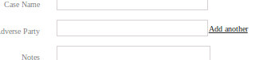
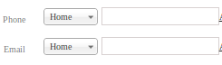

# Customization

**As of this writing, there is no GUI-based method of customizing ClinicCases.  All customization must be done in the database or the config file.  Here is a brief description of how to do this:**

## Customize Groups

Each user in ClinicCases must be put in a group. This is how ClinicCases knows what data each user is allowed to see and what actions they are permitted to take.

Groups are defined in the cm_groups table.  Each group has its own record in the table.  You define a new group by entering in group name (short name for the group for internal use), a display name (name for the group as it will appear to users), and a description.  After that, you define which tabs this group is allowed to see (see [Customize Tabs](#!customization.md#Customize_Tabs) below).  Next follows a list of various permissions the users in this group have.  Set the field to "1" if the group has this permission and "0" if it does not.  So, for example, if users in your new group are allowed to open new cases, set the permission "add_cases" to "1".

Once you save your new group to the database, the group will appear as an option whenever new users are added or current users are edited.

## Customize Tabs

The "allowed_tabs" field in the cm_groups controls which tabs the users in a particular group see.  This field is a serialized array of permitted tab names. The possible permitted tabs are: Home, Cases, Group, Users, Utilities, Board, Journals, and Messages.  So, for example, the allowed_tabs for administrators by default is:

    a:6:{i:0;s:4:"Home";i:1;s:5:"Cases";i:2;s:5:"Users";i:3;s:5:"Board";i:4;s:9:"Utilities";i:5;s:8:"Messages";}

It is not recommended to try to create this string by hand.  It's best to use php to generate the information.  So, to create the string above, we would first define an array in php:

    $tabs = array('Home','Cases','Users','Board','Utilities','Messages');

We then call php's serialize function like so:

    echo serialize($tabs);

This will output the serialized string to put in the allowed_tabs field.

## Customize Case Fields

ClinicCases 7 allows you to change the fields which are associated with each case and which are displayed in Cases table.  To view the default fields, go to the cm_columns table in the database where you will see a list of all the fields.

Each field for the Cases table must be defined in both the cm table AND the cm_columns table.  To add a field, first all a row to the cm table using the traditional mysql definition (name: "my_field, type: "varchar(200)", etc. ). Then go to the cm_columns field and give ClinicCases the metadata about this field.

* **id** - will be set automatically
* **db_name** the name of the field as it appears in the cm table ("my_field")
* **display_name** - the name of the field as it will appear to users ("My Field")
* **include_in_case_table** - tell ClinicCases if the field is supposed to be included in the case table shown to users.  This will almost always be set to "true"
* **input_type** - what sort of input will be used to display this data.  The choices are:
	* text - a standard html text input
	* textarea - a standard html textarea
	* date - will provide a datepicker
	* select - a standard html select
	* multi-text - a ClinicCases widget which presents an input to the user along with a link to "Add Another".  If clicked, another input will be created.  This is used by default for adverse parties.
	
	* dual - a ClinicCases widget which contains two pieces of information: 1) a select with pre-defined types and 2) an input for string data.  This is used by default in ClinicCases for phone numbers and emails.
	
* **select_options** - any time you use a select to define a field (input_type is "select" or "dual"), you must define the choices to be displayed to the user in the select.  This is done by adding a serialized array of choices to the select_options field.  So, for example, if our select choices are "Choice 1", "Choice 2", "Choice 3", we would create an array and call php's serialize function on it:

    $choices = array('Choice 1', 'Choice 2', 'Choice 3');
    echo serialize($choices);

	The output of this code would be placed in the select_options field.

* **display_by_default** - whether or not this field is shown to the user in the Cases table by default.  If this is set to "false", the user will have to click on "Columns" in the Cases tab and place a check by the field name to make it visible.

* **required** - ClinicCases needs this field to function properly.  For any field you create, this would be set to "0" automatically.

* **display_order** - the order in which this field will appear when the user is entering a new case.

Any row which does not have "required" set to "1" may be deleted (required fields are needed for ClinicCases to function properly).  To delete the field, delete the relevant row from the cm_columns table AND the cm table.

## Customizing Case Numbers

Different clinics format their case numbers differently.  ClinicCases allows you to have the following elements in your case numbers:

* Five digit case number which either increments infinitely or resets to "00001" at the beginning of each year

* A four digit or two digit year

* A clinic type ("Family Law", "Community Development", etc.)

* A case type ("Custody", "Civil Rights", "Disability", etc.)

When you run the ClinicCases setup script, you are prompted to enter a default case number mask.  You can subsequently change this by opening the file _CONFIG.php in a text editor.  At line 65, you will see where to enter the case number mask.  The default mask is:

    YYYY-Number

This is a four digit year which resets to "00001" at the beginning of each year.

Possible types for the mask are:

* YYYY or YY for four digit or two digit year
* ClinicType (derived from cm_clinic_type table) or CaseType (derived from cm_case_types table)
* Number or NumberInfinite - Number resets to one at the beginning of each year; NumberInifinite does not.

So, for example, if you wanted to have a case number with a two-digit year which increments infinitely followed by the type of clinic the case is assigned to, you would enter

    YY-NumberInfinite-ClinicType

Your mask must have at least a year value and Number/NumberInfinite, separated by dash.

## Customizing Time Units

ClinicCases supports measuring time units in 5 or 6 minute intervals.  The default value is 5 minutes.  If you would like to change it to 6 minutes, open _CONFIG.php in your text editor and change this line:

    define("CC_TIME_UNIT","6");
