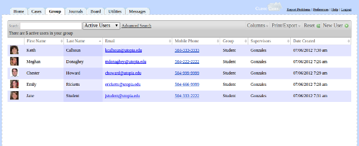
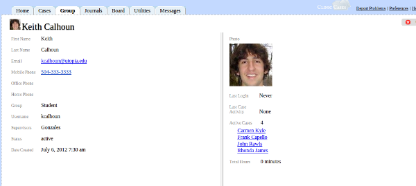

# Group Tab
The Group tab is for those who supervise (any user for whom "supervises" is set to "1" for your group in the cm_groups table (see [customizing groups](customization.md#Customize_Groups)), allowing them to see who is in their supervisory group and their activity.

The functionality is very similar to the [Cases](cases-tab.md) tab.  You can do basic and advanced searches, print and export data, sort, etc.  By default, the Group tab displays supervisees whose accounts are active.  By changing the filter to "inactive", you can display information about users whose accounts are inactive.

When you click on a table row, a detail screen will come up which shows specific information about the user, including their total hours, the cases to which they are assigned, and their latest activity.

The evaluations box allows you to save notes about this user in free-form text.  These evaluations are only viewable by those who supervise the user in question.  So, for example, if student John Doe is supervised by you and Prof. Smith, only you and Prof. Smith can see what is written in the evaluation box.

