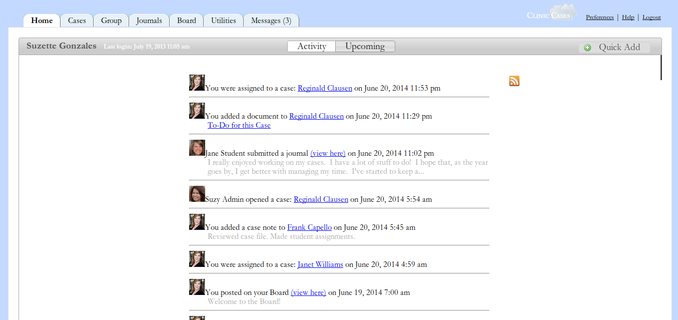
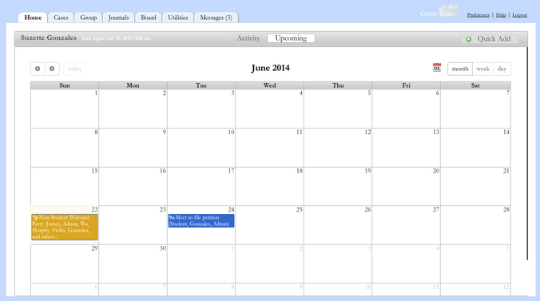
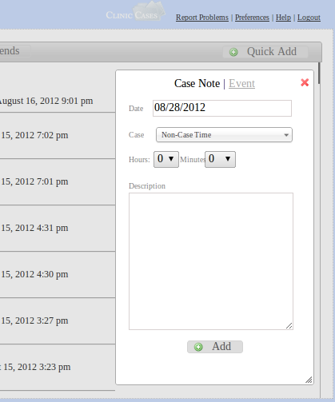

#Home Tab

**The Home tab is designed to give you a quick look at what's going on.  It's broken up into two sections, Activity and Upcoming.**

## Activity

Shows you the latest actions taken on ClinicCases which are relevant to you.

Assuming the default [groups](customization.md#Customize_Groups) are set, professors see every action on a case to which they are assigned and every action taken by users who they supervise.  Students see only every action taken on any case to which they are assigned.  Administrators see information about the opening and closing of cases and about new account requests.  All users see information about [board posts](board-tab.md).

An RSS feed of this activity is available.  Click the RSS icon next to the activity stream and you will be directed to your rss feed.  Add the URL of the feed to your favorite feed reader.  The feed is secured using a private key which is known only to you.  If you suspect that your feed may have been compromised, you can reset the key by going to [Preferences](preferences-tab.md) and clicking on Private Key.

## Upcoming

Shows upcoming events which are relevant to you.

This is a calendar which shows all events to which you have been assigned.  Events can be added in two ways 1) From inside a case, by clicking Events and then "New Event" or 2) using the [Quick Add](home-tab.md#Quick_Add) button on the Home page.  You can switch between Month, Week, and Day views.  Clicking on an event will bring up a details dialog which will show who is assigned to the event and other relevant information.

An Ical feed of your events is available by clicking on the Ical icon at the top of the calendar.  Add the URL of the feed to your calendaring program (e.g, Google Calendar).  Instructions on how to do this for your specific calendaring program are probably available by Googling "how to add Ical feed to [insert name of your calendaring program]."

## Quick Add

Quickly add data to ClinicCases

The Quick Add button is designed for you to quickly enter case notes and events without having to take the extra steps of navigating into a case.  Clicking on the button will bring up a dialog with a choice to add a case note or an event.

With a case note, you select the appropriate case from the list of case to which you are assigned, add a time value, and then add a note.  After you click "Add", the case note will be automatically filed in the case.  Note that the default choice in the case list is "Non-Case Time."  Activity filed here can include things such as class time, attending orientation, etc.  

With an event, you enter the title of the event, where it is taking place, and the start and end times.  You can then associate the event with a case by selecting from the drop-down list.  In the field labeled "Who?", you type in the names of everyone who is responsible for this event.  If you choose a group, everyone in that group will be responsible and will see the event in their calendar feeds. 

Warning! If you do not add yourself to the event or you are not in one of the assigned groups, you will not see the event in your calendar.

