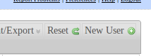
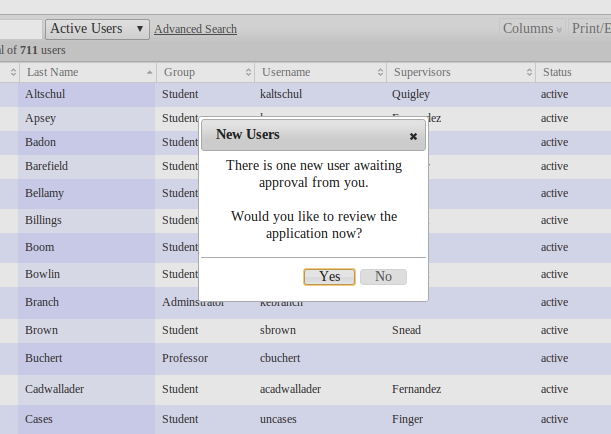

# ClinicCases 7 Documentation

## Getting Started

Once your ClinicCases is installed on your server (see [Installation](installation.md)), here's how to get started. ClinicCases ships with three pre-defined user groups: Administrators, Professors, and Students.  These groups can be [customized](#customization.md).  You should log in using the default administrator account:

* Username: admin
* Password: admin

You will then be prompted to change your password.  Once that is done, click on the Users tab.  You should see that there is only one active user, Temp Admin.  You should add at least one new administrative user by clicking on New User in the upper-right hand corner.

Be sure to include your email address in the new user information.  Check to see if your mail server is working and then check your email for an email with a temporary password to the new account.  Log on to ClinicCases with these credentials and then [change your password](preferences-tab.md).  You can now delete the Temp Admin account by going to Users, opening Temp Admin and pressing delete.

Other users can get accounts in one of two ways: 1) You can add them by clicking on "New User" and inputting the appropriate information for each user or 2) new users can sign themselves up. To do the latter, users should click on "Need an Account?" on the login page.  They will be prompted for the information.  You should then receive an email from ClinicCases notifying you that a new user has signed up.  You (or anyone with an administrative account) must approve the application before that user has access.  To do this, go to the Users tab.  You should see a dialog prompting you to approve the application like this:

If you click yes, you will be brought to a list of new users to be activated.  You can either 1). click on each individual user, review the information, and then set his/her status to active or 2) using the menu at the bottom of the screen (where it says "With Displayed Users"), select "Make Active."  It is important that an administrator review each new user application to ensure that it is a legitimate application and not spam.

Once you have activated the new user, he or she will receive an email confirming that the account is now activated.  The user can log in with the username provided in the email and the password that he or she provided when submitting the application.

If the user application is invalid (a spam sign-up or a duplicate account, for example), you can delete the account by pressing "Delete."

Once you have your users set up, you will want to enter some [cases](cases-tab.md).
