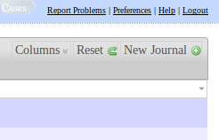
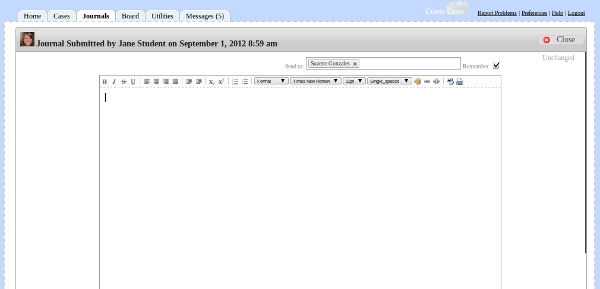
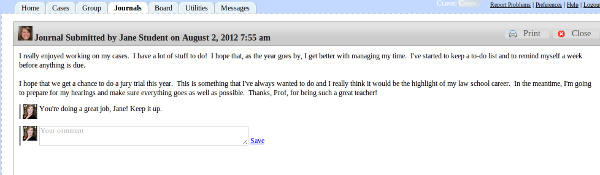

# Journals Tab

**Journaling is an important part of clinical activity and ClinicCases makes it easy to view, send, and store student journals.**

## Writing Journals

Users who have permission to write journals (any user for whom "writes_journals" is set to "1" for their group in cm_groups (see [customizing groups](customization.md#Customize_Groups)), will see a "new journal" button in the upper-right hand corner of the journal screen.

When the student clicks on this button, a text-editor will display for the student to type in their journal.

It is important for the student to designate to whom the journal is to be sent in the "Send To:" box at the top.  A drop-down menu will display of all users who have been designated as journal readers (any user for whom "reads_journals" is set to "1" for their group in cm_groups (see [customizing groups](customization.md#Customize_Groups)) the student can select from one or more of these users.

Journals are automatically saved as they are typed, so there is no need to press save or submit after you have completed your journal.

## Reading Journals

Journal readers will see a list of submitted journals, sorted by those most recently submitted.  Clicking on a row will bring up the text of the journal.  The reader can then comment on the journal by entering comment text in the box below the journal.  Journal writers can then comment back, making it possible to have a two-way discussion about the journal entry.

After the reader has read the journal, it will be marked as read and will disappear from the default list.  To see read journals, just select "Read" from the filter.

It is also possible to archive old journals.  This is most useful at the end of a semester or school year, when you no longer wish to see the journals of students who have finished the course or graduated.  Just set the filter for "All" journals and then, using the "With displayed journals" select at the bottom of the screen, select "Archive."  All journals will then be moved to the archive.  If you ever wish to see archived journals again, just select "Archive" from the filter and you can search for and view the old journals.

