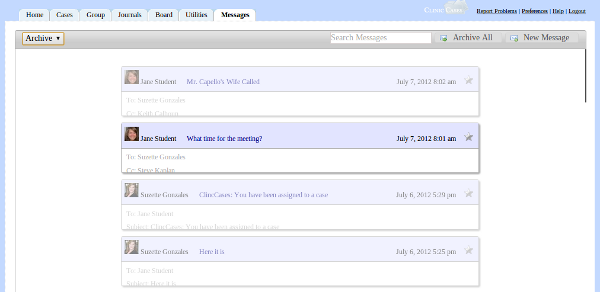
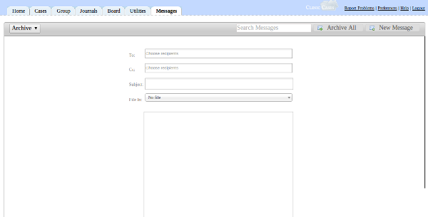

# Messages Tab

The Messages tab is the central place in ClinicCases to view messages sent by other users.  The idea behind messages in ClinicCases is simple: users should be encouraged to
correspond about case matters using Messages rather than email.  That way, this data becomes a permanent part of the case file, rather than being lost to on some distant email server.

When you click the Messages tab, you are shown a list of messages that are in your Inbox.  Clicking on the indididual message will expand it to show the entire text.

From this point, Messages operates much like any other electronic message client.  You can reply to the message or forward it to others.  By clicking the star in the upper right-hand corner of the message, you can mark it is as important for later use.

To compose a new message, click "New Message" in the upper right-hand corner of the screen.  A dialog will appear.

Under "To" and "CC", begin typing the names of the users you would like to receive the message.  A popup dialog will autocomplete the name for you.  You can select to send the message to one or more users, supervisory groups, or user groups.

You can file the message in a particular case file by selecting the name of the case under "File In:".  The cases which are listed are all of those which you have permission to view.  Once you have selected the case, this message will appear in the "Messages" section of the case file.

After typing in your message, press send and the recipients will recieve an email notifying them that they have received a message from you, along with a brief clip of the text.  When the users log on to ClinicCases, they will be notified again that they have a new message and they can go to the Message tab to read the complete message.

You can send all messages in your inbox to the archive by clicking the "Archive All" button in the upper-right hand corner.  To view these messages in the future, just select "Archive" from the select box at the top of the screen.

