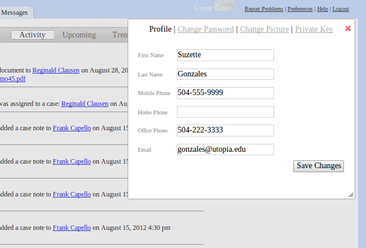

# Preferences

**Preferences allows you to control aspects of ClinicCases which are personal to you.**

* **Profile** - Allows you to change your name, phone numbers, and email address
* **Change Password** - change your ClinicCases password
* **Private Key** - The private key is used for web-based services to access your ClinicCases information.  If you use Ical to export your ClinicCases events or read activity in an RSS reader, this key is used to get this information.  If you suspect that your key has been compromised, click "Reset Key".  A new key will be associated with your account and you can update the web service with the new url which is displayed.

