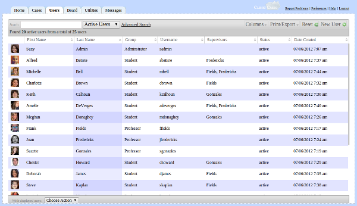

# Users Tab

The Users tab is where those with administrative privileges can add, delete, and edit information about users.  By default, the tab shows a list of all users whose accounts are active.

By changing the filter, you can change this view to "inactive" users or "all" users.  Clicking on "Advanced Search" will allow you to do fine-grained searches for users, e.g. generating a list of all students from the fall semester or a list of all professors, etc.

Much like the [Cases table](cases-tab.md#Cases_Table), the Columns button at  the upper-right hand corner allows you to change which columns are visible in the Users table.

Print/Export allows you to extract data from the Users table by either printing from the browser, generating a pdf file, or generating an excel or csv file.

The "Reset" button will restore the filter to the original "Active" users view.

Clicking on "New User" will bring up a dialog which allows you to enter a new user.  Note that each user must be assigned to a group and their status must be changed to "active."  When you click on "Change Picture", a file upload dialog will prompt you to select a user photo from you computer.  Note that pictures must be at least 128 x 128 pixels.  After the upload is complete, you can crop the picture by dragging your mouse over the displayed image. Once the photo is cropped to your satisfaction, click "Save" and the image will be saved to the server.

When you have finished entering the new user's data, click "Submit" and the new user will receive an email at the address you specified advising him that his account is active and giving him his username and a temporary password.

An administrator (someone who has the permission "activate_users" set to "1"), can reset a user's password. Click the "Reset Password" on the User view.  A new temporary password will be assigned to the user and he or she will be notified by email. The new temporary password will be briefly displayed to the administrator.  This can come in handy when, for example, the user has tried to reset their password by clicking "Forgot Username/Password" and did not receive the email with the new password.

