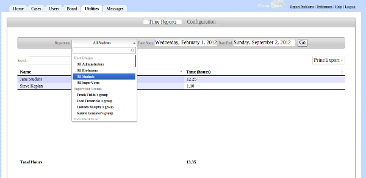
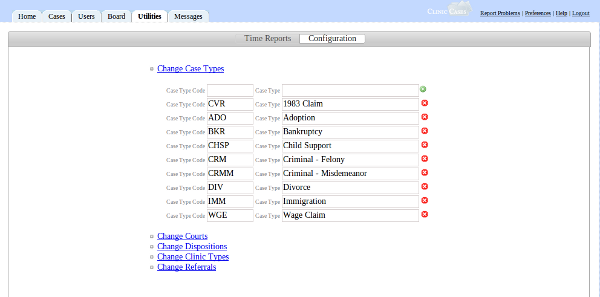

# Utilities Tab

**The Utilities tab contains three views: 1) Time Reports, 2) Configuration, 3) Non-Case Time.**

## Time Reports

The type of reports which can be run depend on the user's permissions.  These are set in the cm_groups table in the ClinicCases database.

* If the field "view_users" is set to "1" (default administrator group), the reports can be run showing the time of all users, all groups, and all cases.

* If the field "supervises" is set to "1" (default professors group), then the user can run time reports on all users he or she supervises, and on all cases to which he or she is assigned.

* If neither of these is set (default students group), then the user can only a report on his or her time entered.

To run a report, you should select the type of report you want and then select a date range.  After you click "Go", a table will display showing the relevant data.  This data can be sorted by clicking on the table row header.  Clicking on Print/Export allows you to print the table or export the data to pdf, csv, or excel.

In these reports, time is expressed by hours and then minutes.  So, for example, a value of 2.15 means "two hours, fifteen minutes."

## Configuration

Configuration allows an adminstrative user (a user in a group for whom "can_configure" is set to "1" in the cm_groups table) to change various default options for ClinicCases.  To change any of the values below, just enter the value(s) and then press the green "plus" button and the value will be added to ClinicCases.  It will now show up in the appropriate drop-menus when you are entering a new case or searching through cases.  To delete these values, click the red "x" button next to the value you wish to delete.

* Change Case Types - Case types are codes and text describing the type for a case.  Typical examples would include "Custody", "Civil Rights", "Criminal", "SSI", etc.  ClinicCases requires that each type have a full text description ("Criminal") and a three-letter code ("CRM"). 

Note: Depending upon your [Configuration](customization.md#Customizing_Case_Numbers), the case type may be appended to the case number, e.g. 2012-00050-CRM.

* Change Courts - This is the list of courts where your clinic practices.  Here, you only have to enter a full text description of the court ("Superior Court for the County of Jefferson") and no code is necessary.

* Change Dispositions - These describe why a case was closed.  Only a full text description is necessary.

* Change Clinic Types - Most law school clinics are divided into sub-clinics, e.g. "Family Law", "Elder Law", "Criminal Defense", etc.  You define the sub-clinics for your clinic here. Note that, depending upon your [Configuration](customization.md#Customizing_Case_Numbers), the clinic type may be appended to the case number, e.g. 2012-00050-FAM.

* Change Referrals - Some clinics like to keep track of their referral sources (e.g., Legal Aid, LSC provider, Social Services).  This is where you add those sources.

## Non-Case Time

This is where users can record any activity not specifically tied to a case, such as class time, attending orientation, or doing reading assignements.  The interface works exactly the same as way as the case notes interface inside a case, allowing you to view, add, edit, or delete time notes.

